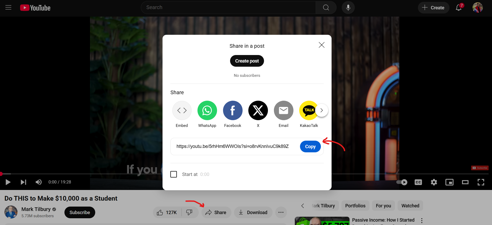
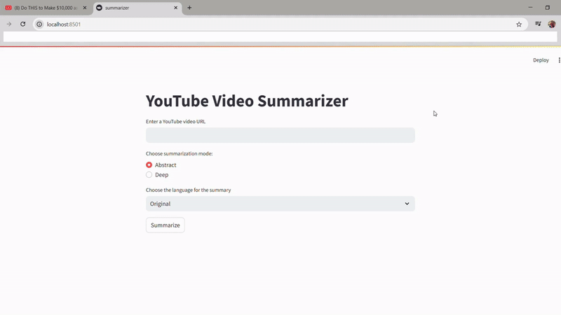

# YouTube-Video-Summarizer

This project is a Streamlit-based web application that provides a summary of YouTube videos using Gemini as the LLM.

Features
--------

*   Summarize YouTube videos in multiple languages.
    
*   Choose between abstract and deep summarization modes.
    
*   User-friendly interface powered by Streamlit.
    

Installation
------------
1. Cloning the repository:
```bash 
git clone cd youtube-video-summarizer
```
    
2.  Creating virtual environment:
```bash
python3 -m transcript_env venvsource venv/bin/activate # On Windows: transcript_env\\Scripts\\activate
```
    
3. Installing all needed packages:
```bash
pip install -r requirements.txt #Optional (should be done if problems with packages will be occured.)
```

4.  Attaching your Gemini API key:
```bash
GEMINI\_API\_KEY1=your\_api\_key
``` 

Usage
-----

1. For running app:
```bash
streamlit run summarizer.py
```    
2.  Open the URL provided by Streamlit in your browser. You should see this:


    
3.  Input the following:
    
    *   `YouTube video URL`, which you want to summarize.
        
    *   `Summarization mode` (abstract or deep). Defaultly: abstract.

    `abstract` mode will provide you a short description of video, like what about the video, what topics are discussed, and short explanation for them etc. .

    `deep` mode will provide you detailed detailed explanation of the video.
    
    
    *   `Output language`. The language in which you want the video description be translated to. Defaultly: Original(no translation).
        
4.  Click the **Summarize** button to receive the summary.


Technologies Used
-----------------

*   Python
    
*   Streamlit
    
*   Gemini API
    
*   Virtual Environment for package management
    

Example
---

*   **Input**: YouTube video URL, "Deep" summarization mode, output language "Armenian."
    
*   **Output**: A detailed summary of the video in Armenian.
    
---
1. Copy URL of the video:


2. Go to the app and RUN IT!



Contribution
------------

Feel free to submit pull requests to improve the app or add new features. Ensure your changes pass existing tests and add new tests if required.
